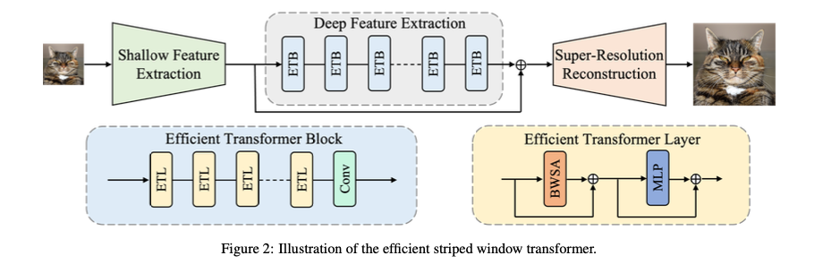
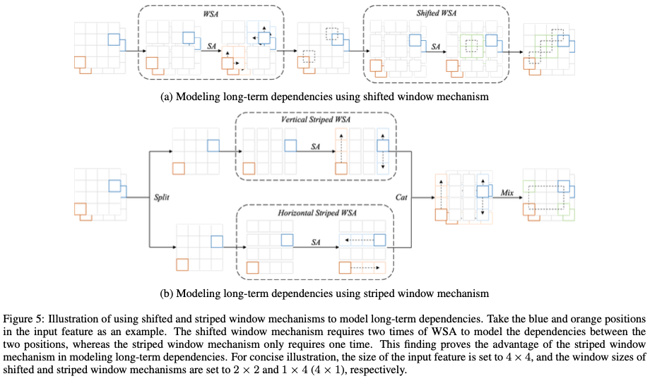
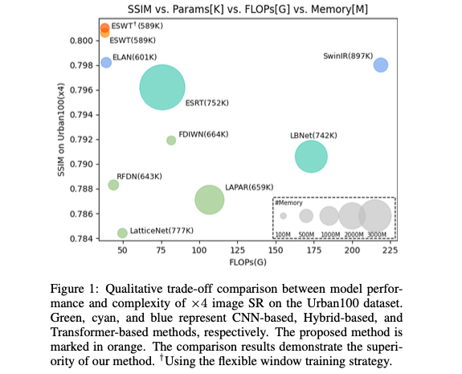
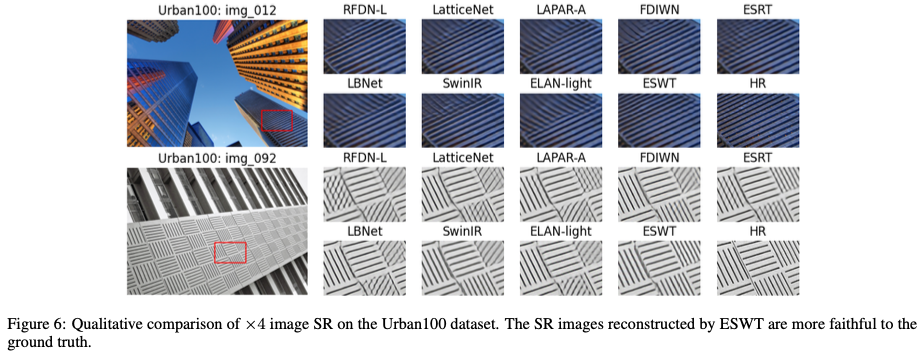
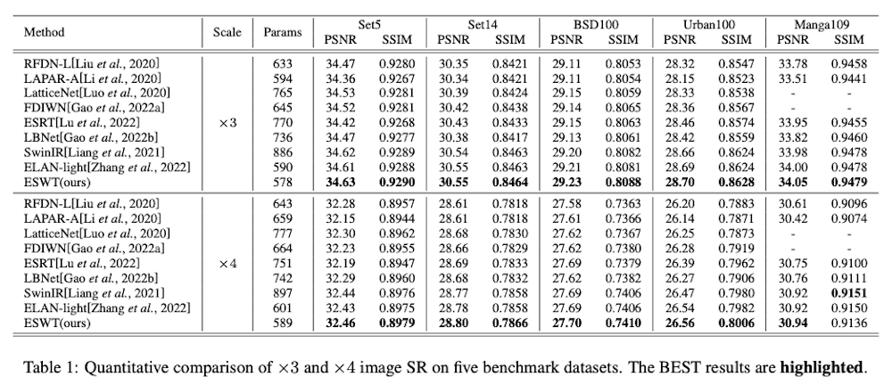
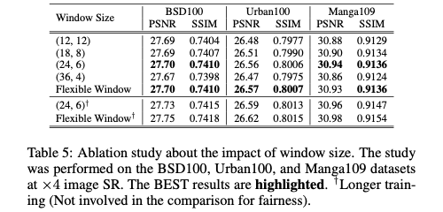
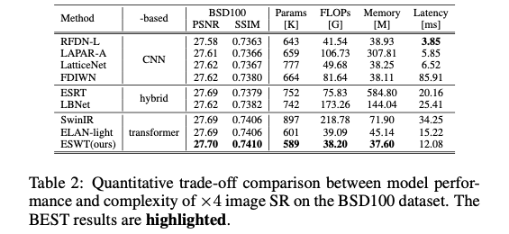

# (ESWT) Image Super-Resolution using Efficient Striped Window Transformer [[arXiv](https://arxiv.org/abs/2301.09869)]

[Jinpeng Shi](https://github.com/jinpeng-s)*^, Hui Li, [Tianle Liu](https://github.com/TIANLE233), [Yulong Liu](https://github.com/LiuYLong), [Mingjian Zhang](https://github.com/Zhang9317112), [Jinchen Zhu](https://github.com/Jinchen2028), Ling Zheng, Shizhuang Weng^

> *: First/Co-first author
>
> ^: Corresponding author

## Quick View

### 1 Abstract

*Recently, transformer-based methods have made impressive progress in single-image super-resolution (SR). However, these methods are difficult to apply to lightweight SR (LSR) due to the challenge of balancing model performance and complexity. In this paper, we propose an efficient striped window transformer (ESWT). ESWT consists of efficient transformation layers (ETLs), allowing a clean structure and avoiding redundant operations. Moreover, we designed a striped window mechanism to obtain a more efficient ESWT in modeling long-term dependencies. To further exploit the potential of the transformer, we propose a novel flexible window training strategy. Without any additional cost, this strategy can further improve the performance of ESWT. Extensive experiments show that the proposed method outperforms state-of-the-art transformer-based LSR methods with fewer parameters, faster inference, smaller FLOPs, and less memory consumption, achieving a better trade-off between model performance and complexity.*

### 2 Methodology

#### 2.1 Model Design



#### 2.2 Striped Window Mechanism



### 3. Experiments

#### 3.1 Trade-off between Model Performance and Complexity



#### 3.2 Visualization Results



## Reproduction Guidance

### 1 Preparation

#### 1.1 Environment

Use the following command to build the Python environment:

```shell
conda create -n frl python
conda activate frl
pip config set global.index-url https://pypi.tuna.tsinghua.edu.cn/simple # Mainland China only!
pip install torch torchvision basicsr einops timm matplotlib
```

#### 1.2 Dataset

Please download the following dataset from our [OneDrive](https://1drv.ms/u/s!AqKlMh-sml1mw362MfEjdr7orzds?e=budrUU) and place the downloaded datasets in the folder `datasets`. **Keep** the local folder `datasets` in the same directory tree as the OneDrive folder `datasets`.

| Dataset  | Description                            |
| -------- | -------------------------------------- |
| DF2K     | Download only if "train from scratch"! |
| Set5     |                                        |
| Set14    |                                        |
| BSD100   |                                        |
| Urban100 |                                        |
| Manga109 |                                        |

#### 1.3 Pretraining Weight

Please download the following pretraining weights from our [OneDrive](https://1drv.ms/u/s!AqKlMh-sml1mw362MfEjdr7orzds?e=budrUU) and place the downloaded pretraining weights in the folder `modelzoo`. **Keep** the local folder `modelzoo` in the same directory tree as the OneDrive folder `modelzoo`.

| Pretraining Weight | Description                                    |
| ------------------ | ---------------------------------------------- |
| ESWT-24-6_LSR_x4   | ESWT using (24, 6) and (6, 24) striped windows |
| ESWT-12-12_LSR_x4  | ESWT using (12, 12) window                     |
| ESWT-fw_LSR_x4     | ESWT using flexible window training strategy   |

### 2 Reproduction

Please use the commands we provide to reproduce the experimental results in the paper.

You may need to make some **manual changes** to file `options/task/LSR_x4.yml`, such as uncommenting certain lines.

#### 2.1 Main results

##### 2.1.1 Table 1

```shell
python test.py -expe_opt options/repr/ESWT/ESWT-24-6_LSR.yml -task_opt options/task/LSR_x4.yml
```

> 🤠 Use the following command instead if you prefer to run in CPU mode:
>
> ```shell
> python test.py -expe_opt options/repr/ESWT/ESWT-24-6_LSR.yml -task_opt options/task/LSR_x4.yml --force_yml num_gpu=0
> ```



##### 2.1.2 Table 5

```shell
# ESWT using (12, 12) window
python test.py -expe_opt options/repr/ESWT/ESWT-12-12_LSR.yml -task_opt options/task/LSR_x4.yml
# ESWT using flexible window training strategy
python test.py -expe_opt options/repr/ESWT/ESWT-fw_LSR.yml -task_opt options/task/LSR_x4.yml
```



#### 2.2 Model Complexity

```shell
# ESWT
python analyse.py -expe_opt options/repr/ESWT/ESWT-24-6_LSR.yml -task_opt options/task/LSR_x4.yml
# ELAN-light
python analyse.py -expe_opt options/expe/ELAN/ELAN_LSR.yml -task_opt options/task/LSR_x4.yml
# SwinIR
python analyse.py -expe_opt options/expe/SwinIR/SwinIR_LSR.yml -task_opt options/task/LSR_x4.yml
```



#### 2.3 Train from scratch

Please modify `CUDA_VISIBLE_DEVICES`, `--nproc_per_node` and `train:batch_size_per_gpu` according to your experimental conditions.

Single GPU:

```shell
CUDA_VISIBLE_DEVICES=0 \
  python \
  -u -m torch.distributed.run \
  --nproc_per_node=1 \
  --master_port=4000 \
  train.py \
  -expe_opt options/expe/ESWT/ESWT_LSR.yml \
  -task_opt options/task/LSR_x4.yml \
  --launcher pytorch \
  --force_yml train:batch_size_per_gpu=64
```

Multiple (e.g., 4) GPUs:

```shell
CUDA_VISIBLE_DEVICES=0,1,2,3 \
  python \
  -u -m torch.distributed.run \
  --nproc_per_node=4 \
  --master_port=4000 \
  train.py \
  -expe_opt options/expe/ESWT/ESWT_LSR.yml \
  -task_opt options/task/LSR_x4.yml \
  --launcher pytorch \
  --force_yml train:batch_size_per_gpu=16
```

## Citation

Please consider citing ESWT if it helps you in your work.

```
@article{shi2023eswt,
  title = {Image Super-Resolution using Efficient Striped Window Transformer},
  author = {Shi, Jinpeng and Li, Hui and Liu, Tianle and Liu, Yulong and Zhang, Mingjian and Zhu, Jinchen and Zheng, Ling and Weng, Shizhuang},
  journal={arXiv preprint arXiv:2301.09869},
  year = {2023},
}
```

## Contact

If you have any questions, please contact [Jinpeng Shi](https://github.com/jinpeng-s) (jinpeeeng.s@gmail.com), Shizhuang Weng (weng_1989@126.com).